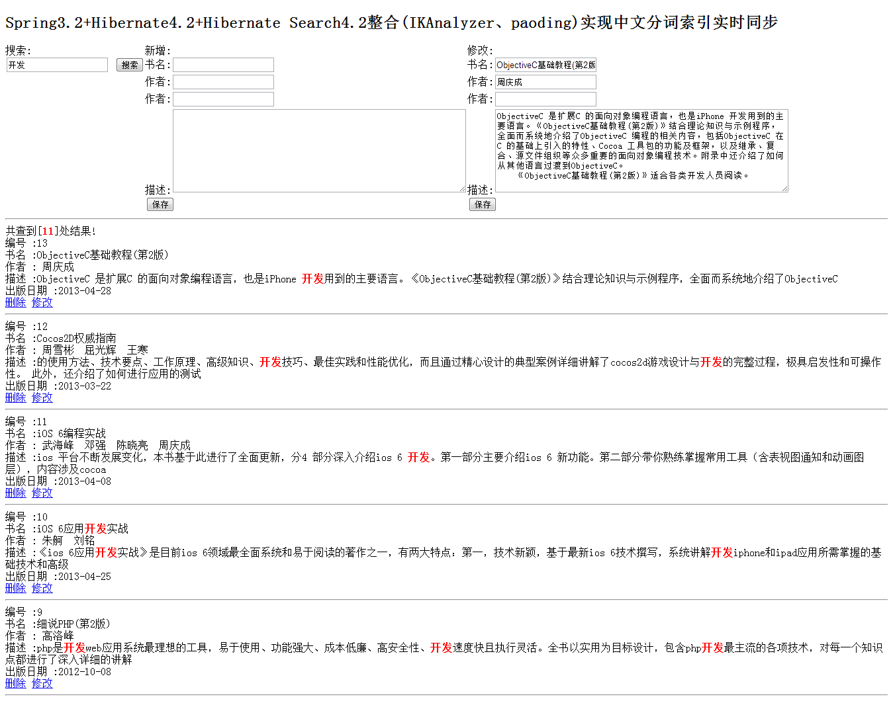

# hibernate-search-example

# 项目描述

Spring3.2+Hibernate4.2+Hibernate Search4.2整合IKAnalyzer、paoding实现中文分词索引实时同步。

# 项目截图

1. hibernate-search-hibernate(基于hibernate4方式的实现)

   spring3.2+hibernate4.2+hibernate search4.2+IKAnalyzer+paoding
2. hibernate-search-jpa(基于jpa方式的实现)

   spring3.2+jpa+hibernate search4.2+IKAnalyzer+paoding

3. hibernate-example(spring3.2+hibernate4+spring mvc整合多对多例子)

   spring3.2+hibernate4.2+spring mvc